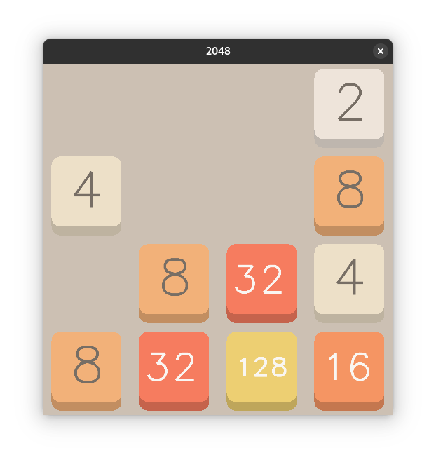

# 2048
2048 game written in C using freeglut library



# Build instructions
You need to install freeglut development files and GNU GCC compiler:

Debian/Ubuntu:
````
sudo apt install gcc freeglut3-dev
````

Fedora:
````
sudo dnf install gcc freeglut-devel
````

Arch:
````
sudo pacman -S gcc freeglut
````

After installing compile 2048.c using this command:

````
gcc 2048.c -o 2048 -lGL -lGLU -lglut -lm
````